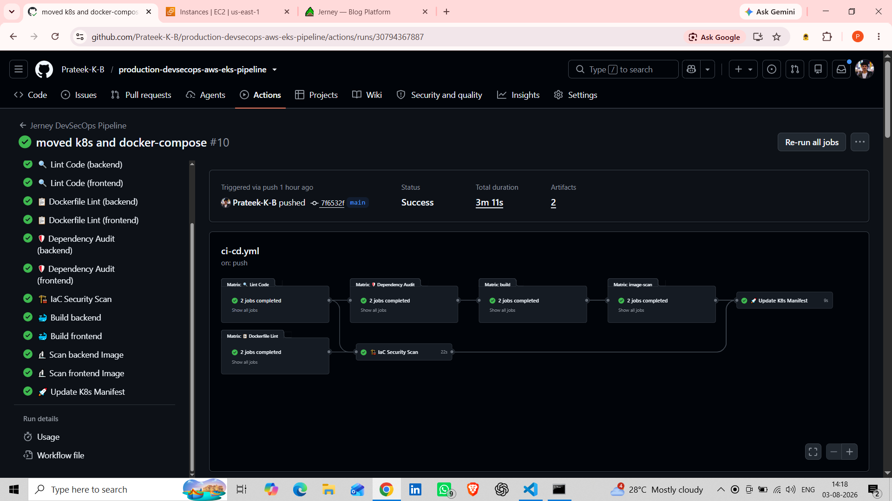
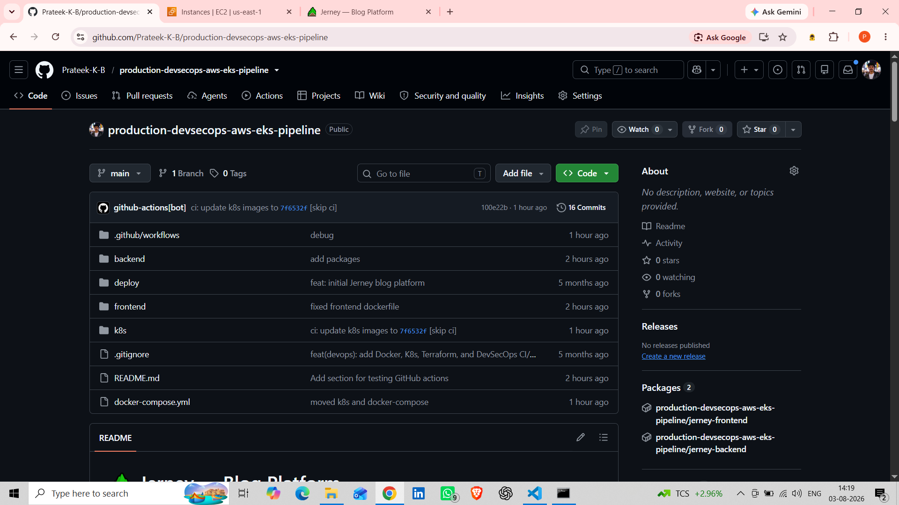
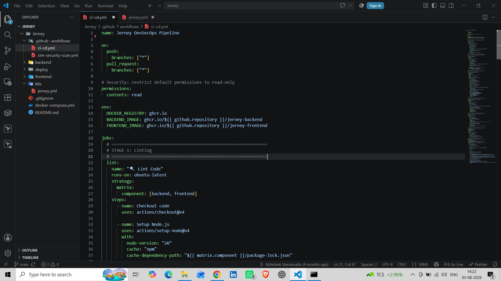
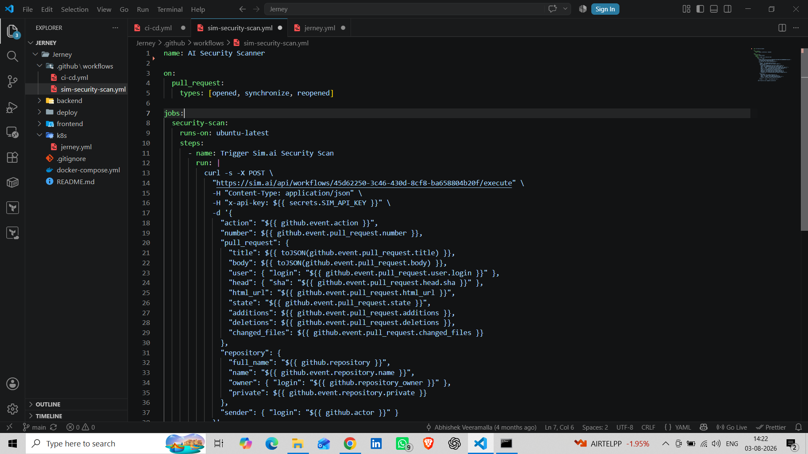
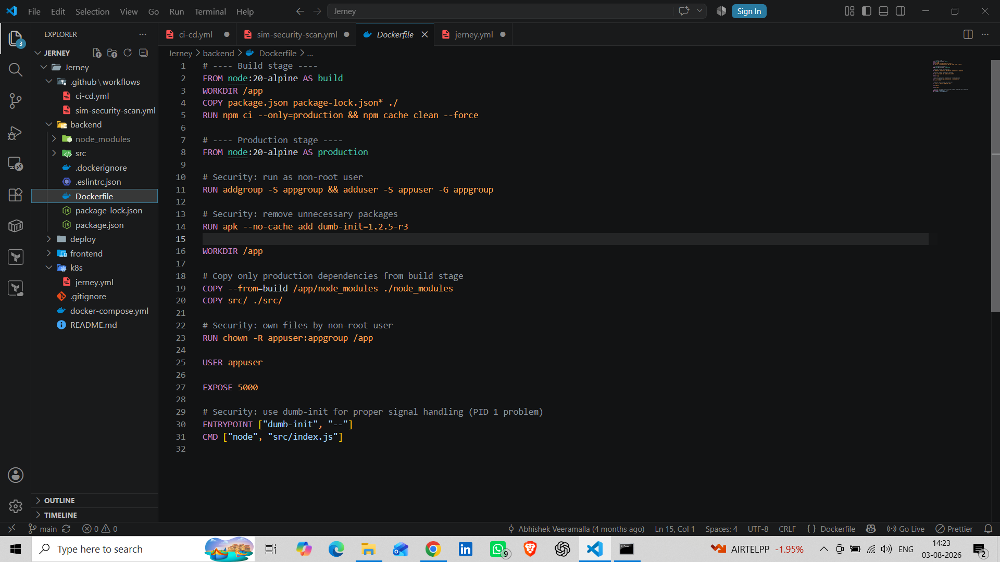
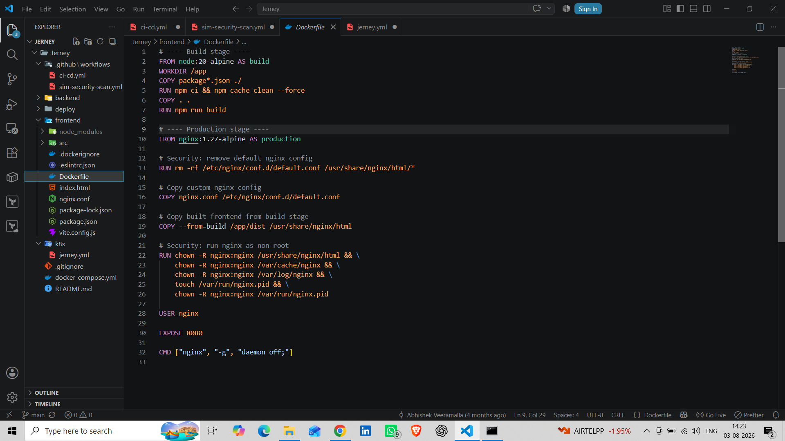
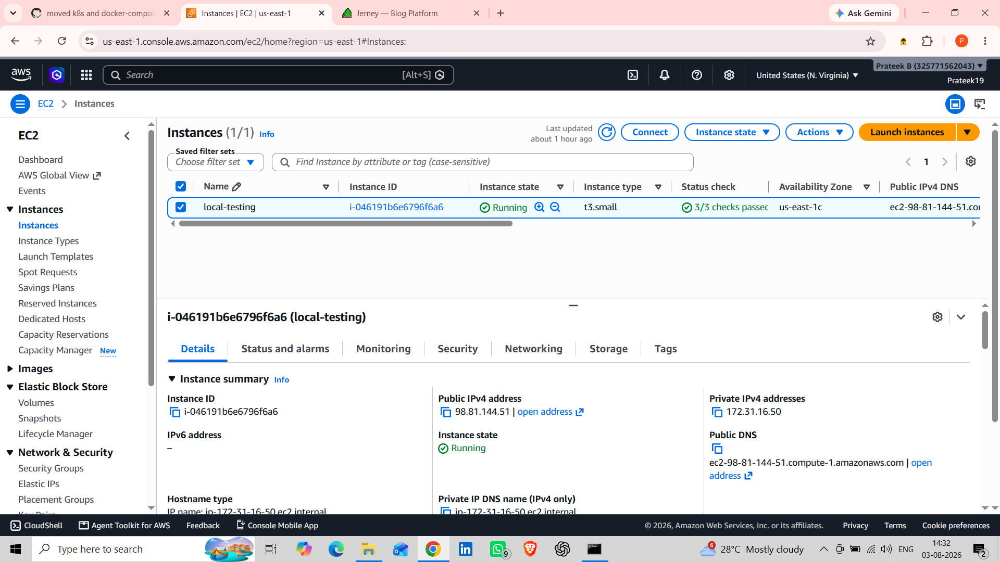
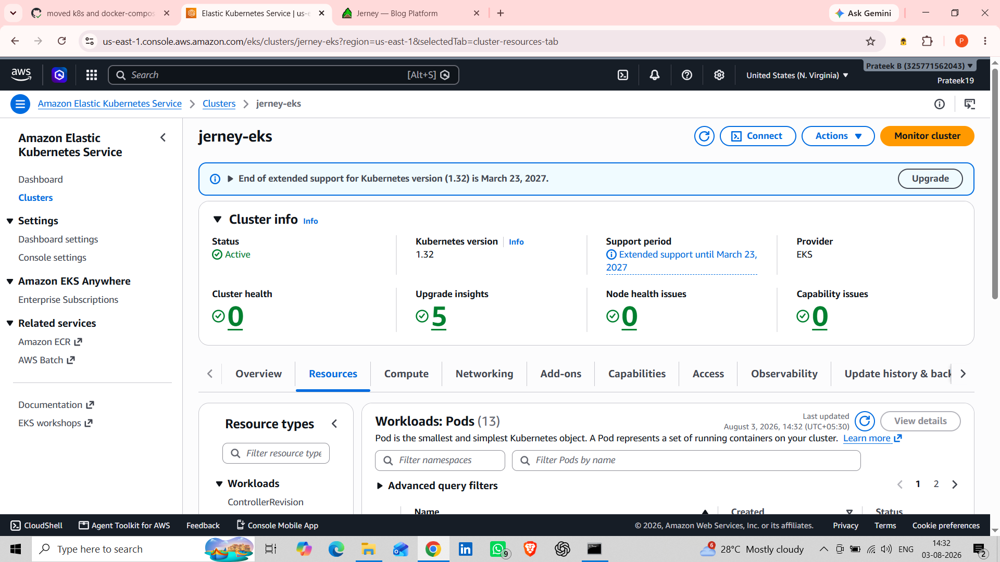
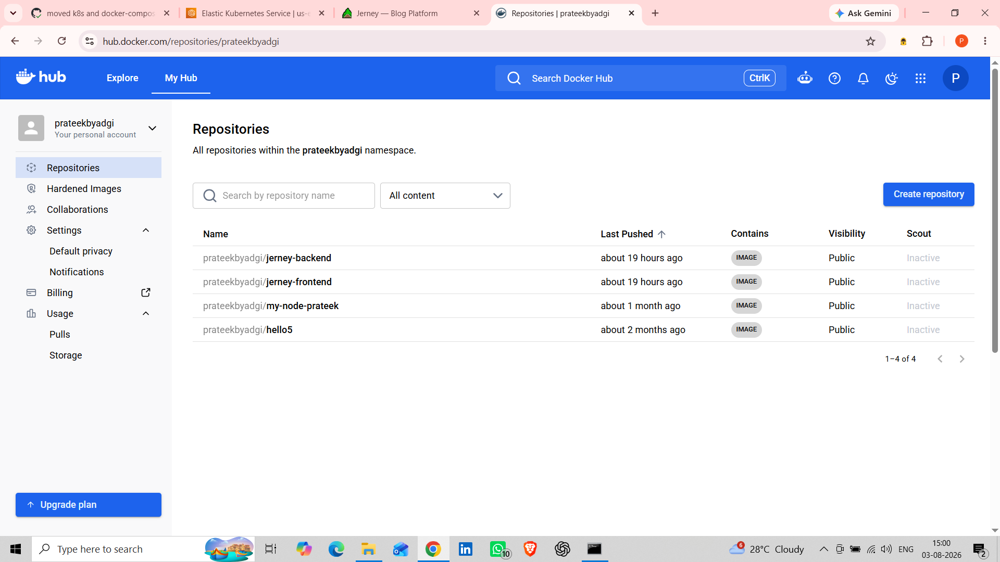

# 🚀 Production DevSecOps CI/CD Pipeline on AWS EKS

## 📌 Project Overview

This project demonstrates a complete **Production-Ready DevSecOps CI/CD Pipeline** deployed on **Amazon EKS**.

The pipeline automates the software delivery lifecycle using **GitHub Actions**, **Docker**, **Docker Hub**, **Trivy**, **Kubernetes**, and **AWS EKS**.

Whenever code is pushed to GitHub, the pipeline automatically performs code quality checks, vulnerability scanning, Docker image creation, image publishing, and Kubernetes deployment.

---

# 🏗 Architecture

```
                Developer
                    │
                    ▼
           GitHub Repository
                    │
                    ▼
            GitHub Actions CI/CD
                    │
     ┌─────────────────────────────────────┐
     │ • Lint Code                         │
     │ • Dependency Audit                  │
     │ • Dockerfile Lint                   │
     │ • Trivy Security Scan               │
     │ • Build Docker Images               │
     │ • Push Images to Docker Hub         │
     │ • Update Kubernetes Manifest        │
     └─────────────────────────────────────┘
                    │
                    ▼
              Docker Hub Images
                    │
                    ▼
              Amazon EKS Cluster
                    │
                    ▼
      Frontend & Backend Kubernetes Pods
```

---

# 🚀 Features

- ✅ Automated CI/CD Pipeline
- ✅ GitHub Actions Workflow
- ✅ Docker Multi-stage Builds
- ✅ Dockerfile Linting
- ✅ Dependency Security Audit
- ✅ Trivy Vulnerability Scanning
- ✅ Docker Hub Image Publishing
- ✅ Kubernetes Deployment
- ✅ Amazon EKS Deployment
- ✅ Production-ready Architecture

---

# 🛠 Tech Stack

| Category | Technologies |
|-----------|--------------|
| Cloud | AWS EC2, Amazon EKS |
| CI/CD | GitHub Actions |
| Containerization | Docker, Docker Compose |
| Security | Trivy |
| Container Registry | Docker Hub |
| Orchestration | Kubernetes |
| Backend | Node.js, Express.js |
| Frontend | React.js |
| Version Control | Git, GitHub |

---

# 📂 Project Structure

```text
production-devsecops-aws-eks-pipeline
│
├── .github/
│   └── workflows/
│       ├── ci-cd.yml
│       └── sim-security-scan.yml
│
├── backend/
│   ├── Dockerfile
│   └── package.json
│
├── frontend/
│   ├── Dockerfile
│   └── package.json
│
├── deploy/
│
├── k8s/
│   └── jerney.yml
│
├── docker-compose.yml
│
└── README.md
```

---

# ⚙ CI/CD Workflow

```
Developer Push

        ↓

GitHub Repository

        ↓

GitHub Actions Triggered

        ↓

Lint Code

        ↓

Dependency Audit

        ↓

Dockerfile Lint

        ↓

Trivy Security Scan

        ↓

Build Backend Docker Image

        ↓

Build Frontend Docker Image

        ↓

Push Images to Docker Hub

        ↓

Update Kubernetes Manifest

        ↓

Deploy to Amazon EKS
```

---

# 📸 Project Screenshots

## 1. GitHub Actions CI/CD Pipeline



---

## 2. GitHub Repository Structure



---

## 3. GitHub Actions Workflow Configuration



---

## 4. AI Security Scanner Workflow



---

## 5. Backend Dockerfile



---

## 6. Frontend Dockerfile



---

## 7. Docker Compose Configuration


---

## 11. AWS EC2 Instance



---

## 12. Amazon EKS Cluster



---

## 13. Docker Hub Repository




---

# 🔐 Security

This project includes multiple security checks:

- Trivy Image Scanning
- Dockerfile Best Practices
- Dependency Vulnerability Audit
- GitHub Actions Security Workflow

---

# 🚀 Future Improvements

- ArgoCD GitOps Deployment
- Prometheus Monitoring
- Grafana Dashboard
- SonarQube Integration
- Slack Notifications
- Helm Charts
- Automated Rollbacks

---

# 📈 Learning Outcomes

Through this project, I gained hands-on experience with:

- Building Production CI/CD Pipelines
- Docker Multi-stage Builds
- GitHub Actions Automation
- Docker Hub Integration
- Kubernetes Deployments
- Amazon EKS Cluster Management
- DevSecOps Best Practices
- Container Security Scanning

---

# 👨‍💻 Author

**Prateek K B**

MCA Graduate | DevOps Engineer | AWS | Docker | Kubernetes | Terraform | GitHub Actions

GitHub:
https://github.com/Prateek-K-B

LinkedIn:
https://www.linkedin.com/in/prateekbyadgi/

---

⭐ If you found this project helpful, don't forget to star the repository!
